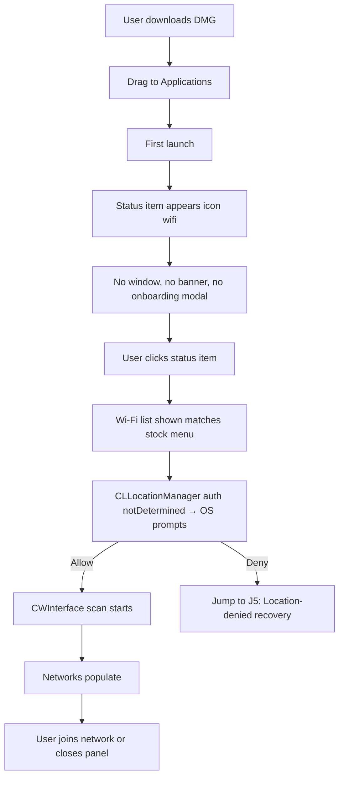
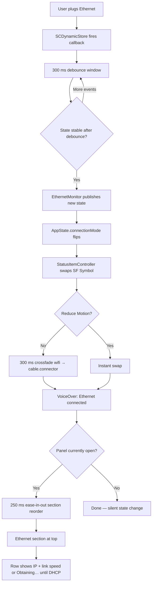
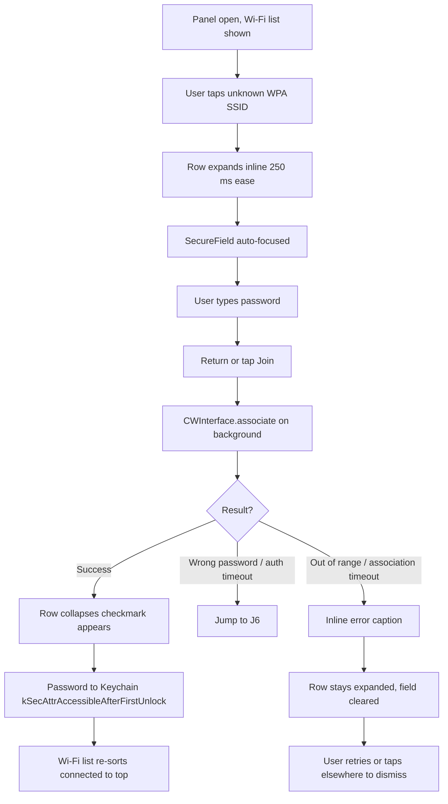
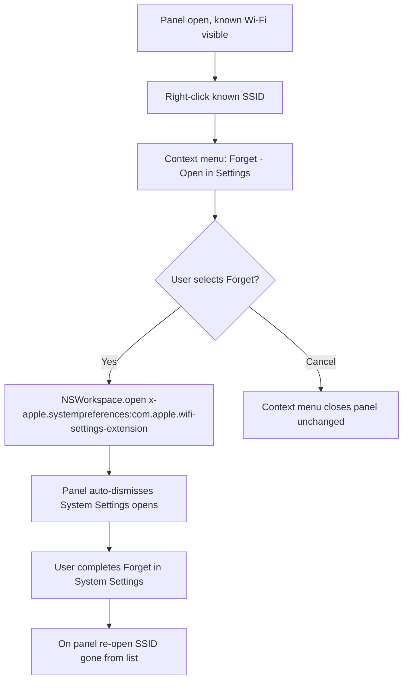
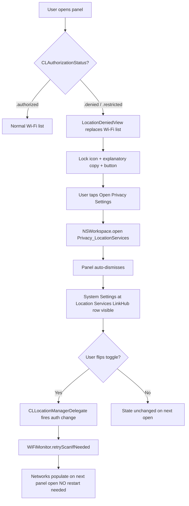
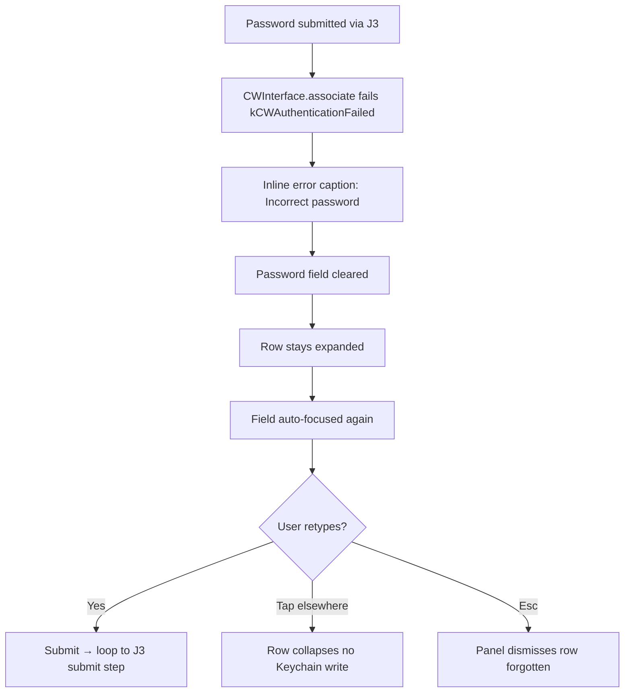

---
stepsCompleted:
  - step-01-init
  - step-02-discovery
  - step-03-core-experience
  - step-04-emotional-response
  - step-05-inspiration
  - step-06-design-system
  - step-07-defining-experience
  - step-08-visual-foundation
  - step-09-design-directions
  - step-10-user-journeys
  - step-11-component-strategy
  - step-12-ux-patterns
  - step-13-responsive-accessibility
  - step-14-complete
lastStep: 14
completedAt: '2026-05-04'
inputDocuments:
  - _bmad-output/planning-artifacts/prd.md
  - _bmad-output/planning-artifacts/prd-validation-report.md
  - docs/01-project-architecture.md
  - docs/02-menubar-integration.md
  - docs/03-network-detection.md
  - docs/04-panel-ui-architecture.md
  - docs/05-ethernet-controls.md
  - docs/06-wifi-management.md
  - docs/07-state-data-management.md
  - docs/08-permissions-entitlements.md
  - docs/09-distribution-release.md
---

# UX Design Specification LinkHub

**Author:** Tal
**Date:** 2026-05-04

<!-- UX design content will be appended sequentially through collaborative workflow steps -->

## Executive Summary

### Project Vision

LinkHub is a macOS menu bar app that unifies Wi-Fi and Ethernet control into a single status item — behaving as a drop-in replacement for the stock Wi-Fi menu when no Ethernet is present, and promoting Ethernet to the top of the panel the moment a cable is plugged in. The product disappears into the user's workflow: zero relearning cost, sub-second icon swap on cable in/out, one click to every network action they used to spread across menu + System Settings.

### Target Users

**Maya — the docking developer.** 14" MacBook Pro, docks at desk, untethers for cafés. Lives in the menu bar. Already has the stock Wi-Fi menu in muscle memory. Wants LinkHub to *be* that menu, plus Ethernet awareness when docked.

**Yossi — the dual-network creative.** Mac Studio with permanent Ethernet to NAS plus Wi-Fi to office router. Both interfaces always live. Wants at-a-glance confirmation of both, plus a faster path to Forget-and-rejoin after router replacements.

**Itai — the cautious newcomer.** New to macOS, declines permission prompts reflexively. Needs a recovery path that turns the most common first-launch failure (Location denied → empty Wi-Fi list) into a guided one-click fix.

All targets are macOS 13+ power users, Apple-HIG-conditioned, menu-bar-fluent. None expect a modal onboarding.

### Key Design Challenges

- **Stock-menu visual parity.** Typography, spacing, signal-bar glyph, lock icon, hover/selection treatment, and animation timing must match the live macOS Wi-Fi menu. Any divergence breaks the thesis.
- **Icon-swap perceptibility.** ≤1.5s cable-in → icon morph must feel intentional, not flickery. 300 ms debounce against dock wake-ups vs. perceived instantness is a real tension.
- **Section reorder without layout jolt.** Ethernet appearing above Wi-Fi mid-session needs a graceful 250 ms ease, with a clean instant fallback if Reduce Motion is on or the animation is unstable.
- **Permission-denied recovery.** `LocationDeniedView` must read as guidance, not error — Itai's journey is the most common first-launch failure mode and the empty state IS the onboarding for the unhappy path.
- **Multi-Ethernet without clutter.** Active-first sort + a "show more in Settings" summary row when interface count exceeds the inline budget.

### Design Opportunities

- **Icon swap as product moment.** A tasteful SF Symbol morph (not abrupt swap) is the visible signature that earns word-of-mouth. Maya's "I've been using LinkHub for a minute without noticing" is the goal; the icon swap is what makes her look back.
- **Pulsing-dot status vocabulary.** Borrowed from Apple's existing connection-state language — extending it to Ethernet (Active / Obtaining / DHCP-timeout / No link) gives LinkHub a quiet visual signature without inventing anything Apple wouldn't.
- **Inline password expansion.** Row expands in place, no modal sheet. Reinforces "one panel, no detours" and quietly differentiates from competing utilities that always pop a sheet.

## Core User Experience

### Defining Experience

LinkHub's defining interaction is the **glance**: open status item → read state → close. Roughly 80% of panel opens are pure status checks with no further action. Connecting to a Wi-Fi network is the secondary action; everything else (Forget, Open Settings, Hidden network, captive portal) is handoff.

The single interaction that *must* be perfect is the **icon swap on cable in/out** — it is the only LinkHub interaction that happens with no user click. If it is late, flickery, or visually inconsistent, the product fails regardless of how good the panel is. The panel can be perfect; without the icon swap, LinkHub is just a worse Wi-Fi menu.

### Platform Strategy

- macOS 13 Ventura and later, Universal binary (Apple Silicon + Intel).
- Persistent background process — `LSUIElement = true`, no Dock, no Cmd+Tab entry.
- Single `NSStatusItem` + transient `NSPopover` (≈ 320pt wide). No window, no preferences pane (v1).
- Mouse/trackpad primary; keyboard support for Esc, Tab, Return on inline password.
- Light/Dark/Auto via system semantic colors only — no hardcoded values. System accent color respected on connected/checkmark glyphs.
- Reduce Motion respected — every animation has an instant fallback.
- Offline by design. Outbound traffic limited to Sparkle appcast and captive-portal handoff (system browser).

### Effortless Interactions

- **Open panel:** single click on status item, ≤ 200 ms cold first paint, ≤ 100 ms warm. No spinner anywhere.
- **State perception:** Ethernet status (when present) and Wi-Fi list visible without scroll, hover, or tab.
- **Connect to known Wi-Fi:** tap row → connect (Keychain-backed, no prompt) — matches stock menu.
- **Connect to unknown WPA Wi-Fi:** tap row → row expands inline → password field auto-focused → Return submits. No modal sheet.
- **Three dismissal paths:** Esc, click outside, or click status item again — all equivalent.
- **Auto-refresh:** CoreWLAN `CWEventDelegate` pushes scan/link/power changes; no manual refresh required.
- **Cross-state continuity:** panel reordering on cable in/out happens silently when closed; while open, 250 ms ease-in-out reorder (instant if Reduce Motion).

### Critical Success Moments

1. **First open post-install (Maya).** Panel layout reads as the stock Wi-Fi menu. Tests *familiarity*. If she has to study the layout, the thesis breaks.
2. **First cable-in (Maya).** Icon morphs in peripheral vision (≤ 1.5 s); opening reveals Ethernet on top. The product's "aha." Tests *adaptive promotion*.
3. **First Location-denied recovery (Itai).** `LocationDeniedView` → one click → Privacy Settings → toggle → networks appear without restart. Tests *unhappy-path grace*.
4. **First "Forget This Network" (Yossi).** Right-click row → Forget → System Settings opens to Wi-Fi pane in correct context. Tests *honest handoff*.
5. **First wrong-password retry (NFR10).** Failure surfaces inline; row stays expanded; field clears; user retypes and connects. Tests *clean failure*.

### Experience Principles

1. **Familiarity beats novelty.** When in doubt, replicate Apple's stock Wi-Fi menu pixel-for-pixel. New patterns are bugs unless explicitly justified by adaptive behavior.
2. **Glance > click.** Read-mostly UI. Optimize the 80% open-look-close path before optimizing any interactive flow.
3. **Adaptive over modal.** Panel rearranges itself by connection state — no tabs, no toggles, no settings.
4. **Handoff, don't reimplement.** Forget UI, Privacy Settings, captive portal — open Apple's surface, never duplicate it.
5. **Motion serves perception.** Animation only exists to make state changes legible (icon morph, section reorder, row expand). Reduce Motion = instant fallback everywhere.
6. **Failure is one click from recovery.** Every error state — permission denied, wrong password, captive — has a visible, single-click next step.

## Desired Emotional Response

### Primary Emotional Goals

The dominant feeling is **invisible competence** — LinkHub should feel like a built-in part of macOS, not a third-party app. The user's reaction after a week of daily use should be "I forgot this isn't from Apple." Not delight. Not excitement. *Belonging.* The word-of-mouth carrier is the half-smile of quiet recognition: "this is what Apple should have shipped already."

### Emotional Journey Mapping

| Stage | Target Feeling | UX Lever |
|---|---|---|
| First open after install | Familiar — "this looks right" | Stock-Wi-Fi-menu visual parity |
| Daily glance | Reassured — "yep, connected" | Read-mostly panel, zero friction |
| First cable-in | Quiet recognition — "oh, that's nice" | Icon morph + section reorder |
| Connecting to new Wi-Fi | Confident — "I already know how to do this" | Connect flow matches stock menu |
| Location-denied recovery | Guided, not stuck | `LocationDeniedView` with one-click path |
| Wrong-password retry | Unembarrassed — "no big deal" | Inline error, field cleared, row stays open |
| Long-term return | Trust — "always there, never wrong" | Zero crashes, zero drift, no surprising updates |

### Micro-Emotions

**Cultivate:** confidence over confusion, trust over skepticism, calm over anxiety, recognition over discovery.

**Anti-goals (actively avoid):**
- *Excitement* — excitement is noise; LinkHub is supposed to fade in
- *Pride of authorship* — no splash, no branding flourish, no version banners
- *Cleverness* — no easter eggs, no UI puns, no novelty for novelty's sake
- *Urgency* — no red badges, no "update now" pressure, no non-critical warnings

### Design Implications

- *Belonging* → exact stock-menu visual parity; system semantic colors only; SF Symbols only; no custom icon vocabulary
- *Calm* → no notifications, no Dock badge, no in-app marketing for updates; Sparkle dialogs only when a real update exists
- *Confidence* → every Ethernet state is named in plain text (Active / Obtaining… / DHCP timeout / No link); never a bare colored dot
- *Trust* → privacy manifest is honest, entitlements minimal, signed + notarized, offline-by-design surfaced in any About surface
- *Quiet recognition* → reserve the single designed "moment" for the icon swap; nothing else is staged
- *Unembarrassed recovery* → inline errors, never modal alerts; failed states preserve user input where they can

### Emotional Design Principles

1. **Disappear, don't perform.** Every UI choice is judged by whether it makes the product more or less noticeable. Less is the win.
2. **No designed moments except one.** The cable-in icon swap is the only deliberate "wow." Everything else is designed to *not* be a moment.
3. **State has words, not just color.** Plain-text state labels everywhere — colorblind-safe, anxiety-free, screenreader-friendly by default.
4. **Quiet failure.** Errors stay inline, never modal. The user's last action and input are preserved on retry.
5. **No urgency theater.** Badges, red dots, "act now" copy are forbidden. The OS already has the urgency vocabulary; LinkHub is not a competing channel.
6. **Trust through transparency.** Offline-by-design, no telemetry, signed + notarized — and where the user can see those facts (privacy manifest, About), they should match the lived experience.

## UX Pattern Analysis & Inspiration

### Inspiring Products Analysis

**1. macOS Stock Wi-Fi Menu (primary reference).** The product LinkHub is replacing-by-extending. Strengths: glanceable read-mostly layout, signal-bar glyph, inline password expansion (Sonoma+), lock and captive markers, "Other Network…" tail row, Wi-Fi power toggle at top, checkmark-left for connected. *Failure mode:* Ethernet is invisible — that gap is the entire reason LinkHub exists.

**2. macOS Bluetooth Menu and Control Center modules.** Strengths: consistent section spacing, capsule headers, "Other…" tail row pattern, Reduce-Motion–aware crossfades. Lesson: Apple's menu-bar modules share a row metric; matching it is what makes a third-party app *feel* native.

**3. Bartender / iStat Menus (cautionary).** Strengths: persistent menu-bar discipline. Anti-lesson: kitchen-sink scope, custom icon vocabulary, dense preferences windows — exactly what LinkHub must not become.

**4. Tailscale macOS menu-bar app.** Strengths: quiet status semantics, single status item that morphs with state, no notification spam. Lesson: a third-party menu-bar app can feel native if it stays disciplined about state surfacing.

**5. 1Password and Raycast popovers (popover UX, not feature parity).** Strengths: ≤ 200 ms cold first paint, keyboard-first dismissal, transient behavior, focus-restoration. Lesson: popover performance budget and dismissal contract — not visual style.

### Transferable UX Patterns

| Pattern | Source | LinkHub Application |
|---|---|---|
| Section header in caption / uppercase + accessory affordance | Stock Wi-Fi menu | Ethernet + Wi-Fi section labels |
| Signal-bar glyph (4 bars, semantic accent) | Stock Wi-Fi menu | Wi-Fi rows — pixel match |
| Inline password expansion within row | Sonoma+ Wi-Fi menu | WPA connect flow — verbatim |
| Lock + captive marker between signal and SSID | Stock Wi-Fi menu | Wi-Fi rows — same position and glyph |
| Checkmark-left for connected row | Stock Wi-Fi menu | Wi-Fi connected indicator |
| "Other Network…" tail row | Stock Wi-Fi menu | Hidden network entry point |
| Pulsing dot for transient/obtaining states | Apple connection-state language | Ethernet "Obtaining…" state |
| Section reorder via crossfade + slide | Apple Control Center | Ethernet section appearance/disappearance, 250 ms |
| Status-icon morph on state change | Tailscale + system Battery menu | Wi-Fi ↔ cable.connector swap |
| Transient popover with 3 dismissal paths | 1Password / Raycast | LinkHub popover behavior |
| Empty state with one-click recovery action | macOS Privacy permission flows | `LocationDeniedView` |

### Anti-Patterns to Avoid

| Anti-Pattern | Origin | Why Banned |
|---|---|---|
| Preferences / Settings window | Bartender, iStat | v1 has no user-configurable settings except Launch-at-Login (right-click menu) |
| Custom icon vocabulary | iStat Menus | Breaks "indistinguishable from Apple" — SF Symbols only |
| Dashboard density (charts, history, graphs) | iStat | Glance > click; LinkHub is read-mostly status, not analytics |
| Modal sheets for password entry | Many Wi-Fi utilities | Breaks one-panel-no-detours; inline expansion only |
| Notification Center interruptions | Some menu-bar apps | Violates calm / no-urgency principle |
| Splash screen / About modal on launch | Various | Violates "disappear, don't perform" |
| Tabs inside the popover | Some utilities | Adaptive panel obviates tabs entirely |
| In-app captive portal browser | Some networking apps | Privacy + complexity — handoff to system browser |
| Custom typography or hardcoded colors | Electron apps | Breaks system-semantic-colors rule and Light/Dark/Auto |
| "Pro" upsell / freemium nag | Many menu-bar utilities | Violates trust + calm |
| Re-implementing Forget Network UI | Possible internal temptation | CoreWLAN API gap + handoff principle (System Settings) |

### Design Inspiration Strategy

**Adopt verbatim** (from stock Wi-Fi menu): typography, spacing, glyphs, inline password expansion, signal-bar accent semantics, "Other Network…" row pattern, checkmark-left connected indicator.

**Adapt:**
- Tailscale / Battery-menu icon-morph pattern → Wi-Fi ↔ cable.connector swap with 300 ms debounce
- Control Center crossfade + slide → Ethernet section show/hide, 250 ms ease-in-out, instant fallback under Reduce Motion
- Raycast / 1Password popover performance contract → ≤ 200 ms cold, ≤ 100 ms warm

**Reject categorically:** preferences windows, custom iconography, dashboard density, dock badges, modal sheets for inline flows, tabs in the popover, splash screens, telemetry, freemium upsells, in-app captive browsers — every Bartender / iStat instinct that violates the tight-scope thesis.

## Design System Foundation

### Design System Choice

LinkHub adopts **Apple Human Interface Guidelines (macOS) + native SwiftUI/AppKit primitives** as its design system. No third-party UI library, no custom design system, no themeable framework. The product thesis — "indistinguishable from Apple" — makes any other choice self-defeating by definition.

### Rationale for Selection

1. **Platform-locked.** macOS 13+, Swift 6, SwiftUI + AppKit. Cross-platform design systems (Material, Ant, MUI, Chakra, Tailwind) do not compile on this stack and would violate platform-native expectations even if they did.
2. **Thesis alignment.** "Indistinguishable from Apple" is the entire product strategy. Adopting any non-Apple visual language is a thesis violation in the first pixel.
3. **Built-in accessibility, theming, localization scaffolding.** Light/Dark/Auto, accent color, Reduce Motion, VoiceOver, Dynamic Type — all free with HIG primitives. Re-implementing any of these is wasted work.
4. **Solo developer constraint.** No design hire, no token-system maintenance overhead. Reference material is the live macOS Wi-Fi menu plus Apple HIG.
5. **Zero third-party UI risk.** Single allowed SPM dependency is Sparkle 2 (NFR36). No CocoaPods, no Carthage, no closed-source UI binaries.

### Implementation Approach

| Layer | Choice |
|---|---|
| Visual language | Apple Human Interface Guidelines (macOS) |
| Component primitives | SwiftUI (`List`, `Button`, `Toggle`, `SecureField`, `Label`) + AppKit interop where SwiftUI is insufficient (`NSStatusItem`, `NSPopover`, `NSEvent` monitoring, `NSHostingController`) |
| Iconography | SF Symbols only — `wifi`, `wifi.slash`, `cable.connector`, `lock.fill`, `globe`, `network` |
| Typography | System font (`Font.system`), HIG type ramp — `.body`, `.callout`, `.caption`, `.caption2`. No custom faces |
| Color | System semantic colors only — `Color.primary`, `.secondary`, `.accentColor`, `Color(nsColor: .separatorColor)`. No hex literals anywhere |
| Spacing / metrics | Stock-Wi-Fi-menu match — 8pt section gaps, 24pt row height, 16pt horizontal padding, 320pt panel width |
| Motion | `.animation(.easeInOut(duration: 0.25))` with `@Environment(\.accessibilityReduceMotion)` instant fallback |
| Accessibility | Native `accessibilityLabel`, `accessibilityHidden`, `NSAccessibility.post(.announcementRequested)` for state transitions |
| Folder structure | Layer-based per PRD 01 (`App/`, `MenuBar/`, `Network/`, `UI/`, `State/`, `Services/`, `Utilities/`) |
| State | Single `@MainActor final class AppState: ObservableObject` (PRD 07). No `@Observable` in v1 (macOS 13 target) |

### Customization Strategy

**No customization** is the default. Every divergence from HIG defaults must be justified against the "indistinguishable from Apple" thesis or filed as a bug. The only LinkHub-specific styling is:

1. Pulsing-dot animation for Ethernet "Obtaining…" state — matches Apple's existing connection-state vocabulary, introduces no novel glyph
2. Status-icon morph timing — 300 ms debounce + crossfade, modeled on Battery menu and Tailscale precedent
3. Section reorder transition — 250 ms ease-in-out for Ethernet section show/hide, instant fallback under Reduce Motion

No tokens file. No theme system. No custom `ButtonStyle`. No custom typography ramp. No custom color palette.

**Banned:**
- Third-party UI dependencies (NFR36 — only Sparkle 2 is allowed)
- Hex color literals
- Custom SF Symbol replacements
- "Theme" or "Style" abstractions beyond what SwiftUI provides natively

## 2. Core User Experience

### 2.1 Defining Experience

**The Cable Moment.** Plug Ethernet → icon morphs in the menu bar within 1.5 s → open panel → Ethernet on top with IP and link speed → close. End-to-end ≤ 3 s, with the icon morph itself requiring zero user click. This single loop is what users describe to friends. Just as Tinder is "swipe," Snapchat is "ephemeral photo," and Spotify is "instant play" — LinkHub is the **cable moment**.

If LinkHub gets exactly one interaction perfectly right, this is it. Everything else (Wi-Fi list parity, password flow, permission recovery) is necessary infrastructure to make the cable moment land in a panel that already feels native.

### 2.2 User Mental Model

**How users solve this today:**
- Stock Wi-Fi menu shows Wi-Fi only — Ethernet is invisible
- System Settings → Network buries Ethernet status four clicks deep
- Power users fall back to Activity Monitor → Network tab, `ifconfig` in Terminal, or staring at the dock's link light

**The frustration on docking** is silence. macOS gives no peripheral-vision signal that Ethernet has taken — the user genuinely does not know whether their NAS sync, Slack call, or upload is routing through 1 Gbps wired or 100 Mbps café Wi-Fi until they go hunt for the answer.

**The mental model LinkHub leverages:** users already monitor the menu bar in peripheral vision (battery, time, Wi-Fi). Surfacing Ethernet there uses an attention channel users have already invested in, with zero relearning cost.

### 2.3 Success Criteria

| Indicator | Target | Source |
|---|---|---|
| Cable-in → icon morph latency | ≤ 1.5 s perceived | NFR1, FR5 |
| Icon morph is single, smooth, no flicker | One morph per cable transition (300 ms debounce) | NFR5 |
| Panel open after morph → Ethernet on top | First section, no scroll | FR12 |
| Ethernet row populated with IP + link speed | Within 5 s of cable-in | FR16–18 |
| Cable-out → section hides gracefully | 1.5 s grace, no flicker on transient unplug | FR13 |
| Reduce Motion → instant icon swap + section show/hide | No animation when system setting on | NFR28 |
| User does not need to click to discover Ethernet status | Peripheral-vision recognition | Journey 2 thesis |

### 2.4 Novel UX Patterns

**Pattern classification: established components, adapted composition.** None of the building blocks are new:
- Status-item morph → Battery menu, Tailscale
- Crossfade section reorder → Control Center modules
- Inline row expansion → Sonoma+ stock Wi-Fi menu

The only LinkHub-specific composition is *combining* a single status item across two distinct network domains (Wi-Fi + Ethernet) with section reorder triggered by physical-layer state. **No new gestures, no new glyphs, no new metaphors — therefore zero user education required.** This is critical: a novel pattern would demand a teaching surface, and FR42 rules out modal onboarding.

### 2.5 Experience Mechanics

**1. Initiation (silent, no click).** User connects Ethernet. `SCDynamicStore` fires callback. 300 ms debounce window absorbs USB-C dock wake fluttering and handshake jitter. Stable state propagates to `AppState`.

**2. Interaction (system-driven, user-passive).** `connectionMode` flips. Status-item SF Symbol crossfades `wifi` → `cable.connector` over 300 ms (instant under Reduce Motion). If the panel is open during the transition, Ethernet section slides to top with 250 ms ease-in-out (instant under Reduce Motion). VoiceOver announces via `NSAccessibility.post(.announcementRequested)`.

**3. Feedback (visible without click).** Menu bar icon now reads as `cable.connector` — the only signal needed to know Ethernet is up. Accessibility label updates to "Ethernet connected, *interface name*, *link speed*." If the user opens the panel, the Ethernet row shows display name + state dot + IP + link speed. "Obtaining…" state shows a pulsing dot until DHCP returns; DHCP timeout (> 15 s) becomes a neutral "DHCP timeout" with no error styling.

**4. Completion (silent close).** Glance, recognize, optionally open panel, dismiss via Esc / click-outside / re-click status item. The loop is read-only — no commit, no submit, no OK button. Cable-out follows the symmetric path: state change → 1.5 s grace → section fades + reorders → icon reverts to `wifi`.

**5. Edge cases the mechanic must absorb:**
- *Cable flap during dock wake:* 300 ms debounce — user sees zero icon flicker
- *Multi-Ethernet (dock + dongle + Thunderbolt):* "active" interface drives icon; all interfaces visible in panel, sorted active-first by stable identifier
- *Ethernet link up, no DHCP yet:* icon swaps on link; row shows "Obtaining…"; IP fills in when lease arrives
- *Ethernet up + Wi-Fi up simultaneously:* both sections visible, Ethernet on top, icon = `cable.connector` (Ethernet is canonically the better link)
- *Unplug during DHCP:* row disappears after grace timer; icon reverts after grace

## Visual Design Foundation

### Color System

System semantic colors exclusively — no hex literals, no custom asset-catalog colors, no `Color(red:green:blue:)` constructors. Light, Dark, and Auto modes are automatic via semantic tokens; the system accent color follows the user's System Settings choice.

| Role | macOS Token | SwiftUI Accessor |
|---|---|---|
| Primary text (SSID, interface name) | `labelColor` | `Color.primary` |
| Secondary text (IP, link speed, tail-row links) | `secondaryLabelColor` | `Color.secondary` |
| Tertiary text (metadata, footer hints) | `tertiaryLabelColor` | `Color(nsColor: .tertiaryLabelColor)` |
| Section header | `secondaryLabelColor` w/ `.caption` uppercase | `Color.secondary` |
| Connected checkmark, interactive accent | System accent | `Color.accentColor` |
| Active-state dot (Ethernet active) | System accent | `Color.accentColor` |
| Pulsing dot ("Obtaining…") | Accent w/ opacity animated 0.4 → 1.0 | `Color.accentColor.opacity(...)` |
| Neutral-state dot (DHCP timeout / No link) | `tertiaryLabelColor` | `Color(nsColor: .tertiaryLabelColor)` |
| Row hover background | `selectedContentBackgroundColor` × 0.25 | `Color(nsColor: .selectedContentBackgroundColor).opacity(0.25)` |
| Row selected background | `selectedContentBackgroundColor` | `Color(nsColor: .selectedContentBackgroundColor)` |
| Separators | `separatorColor` | `Color(nsColor: .separatorColor)` |
| Popover material | `.windowBackground` vibrancy | `NSVisualEffectView` |
| Error inline (wrong password) | `systemRedColor` (text only, no fill) | `Color.red` (sparingly) |

Contrast is automatic — semantic tokens are pre-validated against WCAG AA by Apple. No custom contrast checks needed unless future custom assets are added.

### Typography System

System font only (`.system(...)`); no custom faces. Type ramp measured against the live Sonoma Wi-Fi menu.

| Use | SwiftUI Style | Effective Size | Weight |
|---|---|---|---|
| SSID / Ethernet display name (row primary) | `.body` | 13pt | `.regular` |
| Section header ("ETHERNET", "WI-FI NETWORKS") | `.caption` uppercase + tracking | 10pt | `.semibold` |
| IP, link speed, signal label, "Other Network…" | `.callout` | 12pt | `.regular` |
| Status text under row ("Obtaining…") | `.caption` | 10pt | `.regular` |
| Empty-state body (`LocationDeniedView`) | `.callout` | 12pt | `.regular` |
| Empty-state title (`LocationDeniedView`) | `.headline` | 13pt | `.semibold` |

Dynamic Type and Reduce Transparency are respected automatically by these tokens.

### Spacing & Layout Foundation

8pt base grid (Apple convention). Concrete values measured against the live Wi-Fi menu.

| Element | Value |
|---|---|
| Panel width | 320pt fixed |
| Panel outer padding | 8pt top/bottom, rows extend full width with internal padding |
| Row height (Wi-Fi / Ethernet, single-line) | 24pt |
| Row height (expanded — password entry) | 56pt |
| Row horizontal padding | 16pt left, 16pt right |
| Row internal column gap | 8pt between SSID and accessory clusters |
| Section header height | 24pt (16pt label + 4 + 4) |
| Inter-section gap | 8pt |
| Separator inset | 16pt left, 16pt right (matches row padding) |
| Signal-bar glyph | 16×16pt SF Symbol, regular weight |
| Lock / captive marker glyph | 12×12pt SF Symbol, regular weight |
| Connected checkmark | 16×16pt SF Symbol, semibold, accent color |
| State dot (Ethernet) | 8pt circle |
| Footer / link rows | 24pt row, 16pt padding |

**Layout principles:**
1. **Single-column, top-to-bottom.** No grid, no multi-column, no tabs. Sections stack vertically.
2. **Fixed width, content-driven height.** 320pt wide always; height grows with content; max ≈ 480pt before scroll.
3. **Content density matches stock Wi-Fi menu.** Not "airy," not "dense" — *specifically* what Apple uses. Deviation = thesis violation.
4. **Right-aligned accessory cluster.** Signal bars + lock + captive marker right-aligned per row, mirroring the stock menu.
5. **Window-background vibrancy** via `NSVisualEffectView` — popover blends with desktop like Apple's own menu bar items.

### Accessibility Considerations

- **VoiceOver row coverage** (FR56–58 / NFR23–25): combined `accessibilityLabel` on each row; decorative glyphs (signal bars, dots) marked `accessibilityHidden(true)` — their information lives in the parent label.
- **State-transition announcements** via `NSAccessibility.post(.announcementRequested)`: Wi-Fi-only ↔ Ethernet-active ↔ disconnected.
- **Reduce Motion (NFR28)**: every animation is gated on `@Environment(\.accessibilityReduceMotion)`; instant fallbacks for icon morph, section reorder, row expansion, pulsing dot.
- **Reduce Transparency**: popover material falls back to opaque `.windowBackgroundColor` when system setting is on.
- **Increase Contrast**: semantic tokens auto-adapt; verify by toggling System Settings → Accessibility → Display → Increase Contrast during QA.
- **Dynamic Type**: body and callout respected; row height auto-grows when system text size is bumped.
- **Color is never the sole signal**: every state has a plain-text label adjacent to its dot — colorblind-safe by construction.
- **Keyboard navigation**: Tab through rows, Return to connect, Esc to dismiss, Space to toggle Wi-Fi power. System focus ring; no custom styling.

## Design Direction Decision

### Design Directions Explored

Visual style is locked to Apple HIG verbatim by step 6 and step 8 — generating multi-style visual mockups would be theater. Exploration instead focused on the seven axes where LinkHub has genuine design freedom: section ordering, Wi-Fi power-toggle placement, tail-row content, multi-Ethernet overflow, connected-Wi-Fi position, empty-state tone, and right-click context-menu shape.

Eight directions were considered (six rejected, two partially adopted, one fully adopted as the baseline):

1. **"Stock-menu match"** (recommended baseline) — adopted
2. **"Connected-first hybrid"** — rejected; violates stock-menu parity
3. **"Footer minimalism"** — rejected; Wi-Fi power toggle at footer breaks stock-menu muscle memory
4. **"Settings-heavy footer"** — rejected; multi-column footer violates single-column principle
5. **"Collapsible Ethernet"** — partially adopted (D2 — top-2 inline + "more in Settings…")
6. **"Aggressive empty state"** — partially adopted (F2 wording, single explanatory paragraph + button)
7. **"Stock with right-click power"** — adopted (G3 — Forget + Open in Settings)
8. **"Disconnected zero state"** — adopted as needed empty state with primary action

### Chosen Direction

**"Stock-menu match" + targeted overrides.** Per-axis decisions:

| Axis | Choice | Rationale |
|---|---|---|
| Section ordering | Ethernet on top whenever link present | FR12 + journey 2 thesis |
| Wi-Fi power toggle | Top of Wi-Fi section, right-aligned | Stock-menu muscle memory |
| Tail row | "Other Network…" + "Open Network Settings…" | Hidden-network entry + handoff principle |
| Multi-Ethernet overflow | Top 2 inline + "more in Settings…" tail | Density discipline + Settings handoff |
| Connected Wi-Fi position | Top of Wi-Fi list with checkmark | Stock-menu parity (FR28) |
| `LocationDeniedView` copy | Explanatory paragraph citing Apple's requirement | Honest framing, journey-4 grace |
| Right-click context | Forget + Open in Settings | Discoverable, minimal, no diagnostic creep |

**Locked composition (panel structure):**

```
┌──────────────────────────────────────┐
│ ETHERNET                             │   ← only when link present
│ ●  Apple Thunderbolt                 │
│    192.168.1.42 · 1 Gbps             │
│ ●  USB-C Adapter                     │
│    Obtaining…                        │
│ + 1 more in Settings…                │   ← only when > 2 interfaces
│ ─────────────────────────────────────│
│ WI-FI                          ⏼ ON  │
│ ✓  HomeNet            🔒  ▮▮▮▮       │   ← connected, top
│    OfficeGuest        🔒  ▮▮▮        │
│    cafe-2.4           🔒  ▮▮         │
│    open-net               ▮          │
│ ─────────────────────────────────────│
│ Other Network…                       │
│ Open Network Settings…               │
└──────────────────────────────────────┘
```

### Design Rationale

The chosen direction is *not a creative choice* — it is the disciplined application of the "indistinguishable from Apple" thesis to every layout question that has a canonical Apple answer. Where Apple does not provide a canonical answer (multi-Ethernet overflow, `LocationDeniedView`, Ethernet section presence), the direction defers to the *closest* Apple precedent (Settings handoff, explanatory empty state, Control Center section reordering).

This direction wins by *not* introducing any pattern that requires user education. Direction 2 ("Connected-first") was the most tempting alternative but was rejected because it would make the panel less recognizable to a stock-Wi-Fi-menu user — a thesis violation regardless of any UX-coherence argument.

### Implementation Approach

- Section ordering and visibility driven by `AppState.connectionMode` (PRD 07)
- Wi-Fi power toggle as `Toggle` in Wi-Fi section header, bound to `WiFiMonitor.isPowered`
- Tail rows are simple `Button` rows opening system URLs via `NSWorkspace.open(...)`
- Multi-Ethernet overflow logic: `interfaces.prefix(2)` rendered inline, summary row appears when `interfaces.count > 2`
- Connected Wi-Fi: sort comparator places the row matching `currentSSID` first
- `LocationDeniedView` is a separate top-level view that replaces the Wi-Fi list when `wifiLocationDenied == true`
- Right-click context menu: SwiftUI `.contextMenu { ... }` modifier on Wi-Fi row containing `Forget` and `Open in Settings`

## User Journey Flows

The PRD established four narrative journeys (Maya × 2, Yossi, Itai). This section turns them into interaction mechanics with Mermaid flow diagrams. Two additional flows surface from FR/NFR coverage: WPA inline-connect (extracted from journeys 1 + 3) and wrong-password retry (NFR10).

### J1 — First-Launch (zero-modal onboarding)



### J2 — Cable Moment (defining experience)



### J3 — Connect to new WPA Wi-Fi (inline password)



### J4 — Forget Wi-Fi → System Settings handoff



### J5 — Location-Denied Recovery



### J6 — Wrong-Password Retry



### Journey Patterns

**Navigation patterns:**
- Single-panel discipline — no journey navigates the user away from the panel except via deliberate handoff (J4, J5).
- Three-way dismissal — Esc / click-outside / re-click status item, every journey ends the same way.
- Auto-dismiss on handoff — panel always closes when launching System Settings (J4, J5).

**Decision patterns:**
- State-gated rendering — panel content changes based on `AppState` properties (`connectionMode`, `wifiLocationDenied`, `currentSSID`); never via tabs or toggles.
- Symmetric cable in/out — J2 plays in both directions with the same debounce, animation, and VoiceOver vocabulary.

**Feedback patterns:**
- Inline error captions, never modal alerts (J3, J6 stay in-row).
- Optimistic state — connect attempt shows the row with password field still focused; success flips to checkmark, failure flips to error caption.
- VoiceOver state announcements at every cross-state moment — cable in/out (J2), permission flip (J5), successful connect (J3).

**Recovery patterns:**
- Failed connect preserves context — field cleared, row open, focus retained.
- Permission state recoverable without restart — J5 relies on `CLLocationManagerDelegate` re-firing.
- Forget handoff is one-way — LinkHub doesn't try to programmatically confirm; stale Keychain entry is acceptable.

### Flow Optimization Principles

1. **Steps to value:** 1 click for known networks, 2 clicks (tap row → password) for new WPA networks. Anything more = regression vs. stock menu.
2. **No spinner UI.** Latency budgets (NFR2 ≤ 200 ms cold paint, NFR3 5 s scan) are short enough that spinners announce slowness rather than hide it. If a "scanning" indicator is needed, surface it as a single subtitle line, never a spinner overlay.
3. **Errors are captions, not alerts.** No `NSAlert.runModal()` in user-facing flows. Every failure stays inline.
4. **Handoff > re-implementation.** J4 and J5 punt to System Settings rather than building in-app surfaces — preserves trust and scope discipline.
5. **State observability over user action.** The cable moment (J2) is canonical: the user takes no UI action; the state change is the experience.

## Component Strategy

### Design System Components

Foundation components are pulled directly from SwiftUI and AppKit — no custom specification required. They are used as Apple ships them.

| Component | Source | Use |
|---|---|---|
| `Button` | SwiftUI | Tail rows, password Join, settings handoffs |
| `Toggle` | SwiftUI | Wi-Fi power |
| `SecureField` | SwiftUI | Inline password entry |
| `Label` | SwiftUI | Section headers, footer links |
| `Image(systemName:)` | SwiftUI | All glyphs (SF Symbols only) |
| `Divider` | SwiftUI | Section separators |
| `VStack` / `HStack` / `Spacer` | SwiftUI | Layout |
| `NSStatusItem` | AppKit | Menu bar item |
| `NSPopover` | AppKit | Panel container |
| `NSHostingController` | AppKit | SwiftUI ↔ AppKit bridge |
| `NSVisualEffectView` | AppKit | Popover material vibrancy |
| `.contextMenu { }` | SwiftUI | Right-click on Wi-Fi rows |

### Custom Components

Eight LinkHub-specific components. Each is a thin composition of foundation primitives — no novel rendering, just state-bound assembly.

#### `StatusBarIcon`

- **Purpose:** Drives `NSStatusItem.button` image and accessibility label from `connectionMode`.
- **Anatomy:** `NSImage(systemSymbolName:)` + `.accessibilityLabel`.
- **States:** `.wifiOnly(strength:)`, `.wifiOff`, `.ethernetActive(displayName:speed:)`, `.disconnected`.
- **Animation:** 300 ms crossfade on state change; instant under Reduce Motion.
- **Accessibility:** label updates per state — e.g., "Ethernet connected, Apple Thunderbolt, 1 Gbps".
- **PRD:** 02.

#### `RootPanelView`

- **Purpose:** Top-level SwiftUI view inside the popover; orchestrates section visibility from `AppState`.
- **Anatomy:** `VStack(spacing: 8) { EthernetSection?; WiFiSection; FooterRows }`.
- **States:** Wi-Fi-only, Ethernet + Wi-Fi (Ethernet on top), location-denied, all-disconnected.
- **Animation:** 250 ms ease-in-out section reorder; instant under Reduce Motion.
- **Accessibility:** posts `NSAccessibility.announcementRequested` on `connectionMode` change.
- **PRD:** 04, 07.

#### `EthernetSection`

- **Purpose:** Renders top 2 active interfaces inline + overflow summary.
- **Anatomy:** caption-uppercase header → top-2 `EthernetRow` → optional "+ N more in Settings…" overflow row.
- **States:** present (any interface has link) / hidden (after 1.5 s grace timer).
- **PRD:** 04, 05.

#### `EthernetRow`

- **Purpose:** Single Ethernet interface display.
- **Anatomy:** `HStack { StateDot; VStack(.leading) { displayName(.body); detail(.caption) } }`.
- **States:** `.active(ip:speed:)`, `.obtaining`, `.dhcpTimeout`, `.noLink` — each pairs a dot color with a plain-text label so color is never the only signal.
- **Accessibility:** combined label, e.g., "Apple Thunderbolt, active, 192.168.1.42, 1 Gbps".
- **PRD:** 05.

#### `WiFiSection`

- **Purpose:** Wi-Fi list + power toggle + tail rows.
- **Anatomy:** header (`Label("WI-FI") + Toggle($isPowered)`) → connected row → other networks → "Other Network…" → "Open Network Settings…".
- **States:** powered-on-with-networks, powered-on-empty, powered-off (list hidden), location-denied (delegates to `LocationDeniedView`).
- **PRD:** 06.

#### `WiFiRow`

- **Purpose:** Single network display with optional inline password expansion.
- **Anatomy:** `HStack { Checkmark?; SSIDText(.body); Spacer; LockIcon?; CaptiveIcon?; SignalBars }` + collapsible `SecureField` row when expanded.
- **States:** `.normal`, `.connected`, `.expanded(password:error:)`, `.connecting`.
- **Animation:** 250 ms expand/collapse; instant under Reduce Motion.
- **Right-click:** `.contextMenu { Button("Forget"); Button("Open in Settings") }` — only on rows matching a known SSID.
- **Accessibility:** combined label; VoiceOver announces error captions when they appear.
- **PRD:** 06.

#### `LocationDeniedView`

- **Purpose:** Empty-state replacement for Wi-Fi list when Location authorization is denied or restricted.
- **Anatomy:** centered `VStack` — lock icon + headline + body paragraph + "Open Privacy Settings" button.
- **Copy:** headline "Location access required"; body "LinkHub needs Location access to scan for Wi-Fi networks. Apple requires this on macOS 10.15+."
- **PRD:** 06, 08.

#### `OtherNetworkPanel`

- **Purpose:** Hidden-network entry — replaces `RootPanelView` content rather than overlaying (single-panel discipline).
- **Anatomy:** title + SSID `TextField` + security `Picker` (Open / WPA / Enterprise) + conditional `SecureField` + Cancel / Join buttons.
- **States:** entry, validating, error (uses the J6 inline-error pattern).
- **Navigation:** triggered by "Other Network…" row; Cancel returns to `RootPanelView`.
- **PRD:** 06.

### Component Implementation Strategy

- All components live under `UI/` per PRD 01 layer-based folder structure.
- Components observe a single `@MainActor AppState: ObservableObject` via `@EnvironmentObject` — never the source monitors directly (NFR35).
- No custom `ButtonStyle`, no custom `LabelStyle` — system styles exclusively.
- All animations gated on `@Environment(\.accessibilityReduceMotion)` with instant fallback.
- All decorative glyphs (signal bars, dots) marked `accessibilityHidden(true)`; their information lives in the parent row's combined label.
- No component owns local state for data — all rendering is driven from `AppState` (single source of truth).
- Each component must include a `#Preview` block exercising every named state, for design iteration without launching the app.

### Implementation Roadmap

Aligned with the PRD's 5-wave EXECUTION_PLAN.

**Phase 1 — Wave 2 (state foundation, panel skeleton):**
- `RootPanelView` skeleton — wires popover + status item
- `StatusBarIcon` 2-state (wifi/cable.connector) — minimum to validate the cable-moment thesis

**Phase 2 — Wave 3 (Wi-Fi):**
- `WiFiSection`, `WiFiRow` (read-mostly: list, signal bars, lock, captive, connected check)
- `LocationDeniedView` (J5 unhappy path before any happy path is solid)
- `WiFiRow` inline-password expansion (J3 happy + J6 retry)
- `OtherNetworkPanel` (hidden network entry)

**Phase 3 — Wave 4 (Ethernet):**
- `EthernetSection`, `EthernetRow` with all 4 states (active / obtaining / DHCP-timeout / no-link)
- Multi-interface enumeration + overflow row
- Cable-moment animation polish (300 ms crossfade + 250 ms section reorder)

**Phase 4 — Wave 5 (release):**
- Right-click context menu (Forget / Open in Settings)
- VoiceOver pass: combined labels, decorative-hidden, state-transition announcements
- Reduce Motion / Reduce Transparency / Increase Contrast verification

## UX Consistency Patterns

(Mobile patterns intentionally omitted — LinkHub is macOS-only, mouse/trackpad/keyboard, no touch.)

### Button Hierarchy

| Tier | SwiftUI Style | When | Examples |
|---|---|---|---|
| Primary | `.borderedProminent` | Single critical action in empty / recovery state | "Open Privacy Settings", "Turn Wi-Fi On" |
| Secondary | `.bordered` | Form submit alongside Cancel | "Join" in `OtherNetworkPanel` |
| Tertiary | `.plain` link-styled | Inline navigation / handoff | "Other Network…", "Open Network Settings…" |
| Cancel | `.bordered` | Form dismiss | "Cancel" in `OtherNetworkPanel` |

Rules: at most one primary per view; the main panel has none (read-mostly). No primary inside the row list — connect happens by row tap. No `.destructive` style; Forget is a context-menu item using system styling.

### Feedback Patterns

| Channel | Use | Visual | Example |
|---|---|---|---|
| Inline caption | Result on the row that initiated the action | `.caption` text, `Color.red` for error or `Color.secondary` for info | "Incorrect password" |
| Status dot + label | Persistent state of an interface | filled circle + plain-text label | Ethernet "Obtaining…" / "Active" |
| Checkmark | Connected / terminal-success state | `Image(systemName: "checkmark")` accent | Connected Wi-Fi row |
| VoiceOver announcement | Background state transitions | `NSAccessibility.post(.announcementRequested)` | Cable in/out, permission flip |
| Status-item icon morph | Background state surfaced in the menu bar | SF Symbol crossfade | Wi-Fi ↔ cable.connector |

**Banned:** `NSAlert.runModal()`, `UNUserNotification`, Dock badges, toast / banner notifications, spinners, progress indicators. There is no "warning" tier — either it is an error (red caption + retry path) or it is not.

### Form Patterns

- Auto-focus the first input when a form appears.
- Return submits the primary action; Esc dismisses without submitting.
- On error: clear field, retain focus, surface inline caption below; keep the row / panel open.
- No "type to confirm," no required-field asterisks; forms have ≤ 3 fields and validation surfaces only at submit.
- Validation deferred to the system API (`CWInterface.associate`) — no client-side WPA-key length checks.
- Keychain writes occur on success only; failed attempts never persist credentials.

### Navigation Patterns

- Single-panel discipline — every flow lives in `RootPanelView` except `OtherNetworkPanel`, which fully replaces it.
- No tabs, no segmented controls, no drill-down. State changes by data binding, not by user navigation.
- No back chevrons; `OtherNetworkPanel` has an explicit Cancel button.
- System Settings handoff auto-dismisses the popover before the system pane opens.
- Status-item click toggles popover open/closed; three dismissal paths total — Esc, click-outside, re-click status item.
- Right-click on status item opens a context menu (Quit + Launch-at-Login toggle), not a panel.

### Empty / Loading / Zero States

| State | Visual | Copy | Action |
|---|---|---|---|
| Wi-Fi list empty (powered on, no networks in range) | `.callout` centered in section | "No networks found" | None — CWEventDelegate auto-rescans |
| Wi-Fi powered off | Section header only, list hidden | "Wi-Fi: Off" with toggle | Toggle on |
| All disconnected | Centered zero-state | "Wi-Fi is off / No Ethernet connected" | "Turn Wi-Fi On" primary button |
| Location denied | `LocationDeniedView` | Headline + body | "Open Privacy Settings" |
| Initial scan / connecting | None — list shows existing data; new results merge in | n/a | n/a |

**No loading state** is itself the pattern. Read-mostly UI + push-event refresh + ≤ 200 ms cold paint = nothing to load *for*.

### Animation & Motion Patterns

| Trigger | Duration | Curve | Reduce Motion |
|---|---|---|---|
| Status icon morph | 300 ms | ease-in-out crossfade | Instant swap |
| Section reorder | 250 ms | ease-in-out | Instant |
| Row expand / collapse | 250 ms | ease-in-out | Instant |
| Pulsing dot ("Obtaining…") | 1.2 s loop | opacity 0.4 → 1.0 ease-in-out | Static dot at 1.0 |
| Popover open / close | System default | system-managed | Auto-respected |

**No animation longer than 300 ms.** Motion serves perception, never decoration.

### Copy & Tone

- Apple's voice: short, definite, no marketing register, no hedging.
- Plain English: "Obtaining address," not "Acquiring DHCP lease." "No link," not "Cable disconnected (status: down)."
- No exclamation points anywhere.
- Sentence case for body; UPPERCASE caption for section headers.
- Avoid blame: "Incorrect password," not "You entered the wrong password." "Location access required," not "You denied Location access."
- Cite Apple when explaining constraints — "Apple requires this on macOS 10.15+" reads as platform reality, not LinkHub limitation.
- Use ellipsis (…) for handoffs: "Other Network…", "Open Network Settings…", "Open Privacy Settings…"

### Custom Pattern Rules

1. **Any pattern not listed here defers to Apple HIG.** This document covers LinkHub-specific decisions; everything else is HIG.
2. **New patterns must justify themselves against the "indistinguishable from Apple" thesis.** Default answer is "use the HIG pattern."
3. **Pattern violations are bugs.** A reviewer flagging "row uses 18pt instead of 16pt padding" is correct on the spec's terms, not pedantic.

## Responsive Design & Accessibility

### Responsive Strategy

LinkHub is a fixed-width 320pt `NSPopover` on macOS only — no tablet, no mobile, no browser. CSS-style breakpoints do not apply. The single layout adapts only along macOS-native axes.

| Adaptive Axis | Behavior |
|---|---|
| Display scale (Retina vs. non-Retina) | Vector SF Symbols + semantic `Color` rendering — automatic |
| Display height | Panel height grows with content; max ≈ 480pt before internal `ScrollView` engages |
| Status-item position near screen edge | `NSPopover` repositions via system anchoring — no app code needed |
| Multi-monitor | Popover appears on the screen containing the menu bar — system-managed |
| Light / Dark / Auto appearance | Semantic colors auto-adapt |
| Accent color | `Color.accentColor` follows System Settings |
| Dynamic Type | `.body` / `.callout` / `.caption` scale; row height grows accordingly |
| Reduce Motion | All animations have instant fallback (NFR28) |
| Reduce Transparency | Popover material falls back to opaque `.windowBackgroundColor` |
| Increase Contrast | Semantic tokens auto-adapt |
| Differentiate Without Color | Already satisfied — every state has a plain-text label adjacent to its color signal |

### Breakpoint Strategy

**No CSS-style breakpoints.** No layout switching. The single 320pt-wide layout serves every macOS configuration. The only "breakpoint" is content-driven panel height; once content exceeds ≈ 480pt, an internal `ScrollView` engages.

### Accessibility Strategy

**Compliance target: WCAG 2.1 AA + Apple Accessibility Inspector clean.**

| Capability | Approach | Source |
|---|---|---|
| Color contrast | System semantic colors (Apple-validated AA) | NFR23 |
| Keyboard navigation | Tab / Return / Esc / Space; system focus ring | NFR23 |
| VoiceOver — rows | Combined `accessibilityLabel`; decorative glyphs `accessibilityHidden(true)` | FR56–58, NFR23–25, NFR27 |
| VoiceOver — transitions | `NSAccessibility.post(.announcementRequested)` on state changes | FR58, NFR26 |
| Reduce Motion | All animations gated on `@Environment(\.accessibilityReduceMotion)` | NFR28 |
| Reduce Transparency | Opaque `.windowBackgroundColor` fallback | NFR28 |
| Increase Contrast | Auto-adapts via semantic tokens | NFR31 |
| Dynamic Type | All text uses system styles | — |
| Color independence | Every state has a plain-text label; color is never the sole signal | Step-12 patterns |
| Touch targets | N/A — macOS mouse-pointer surface | — |

#### VoiceOver Label Templates

| Row Type | Template | Example |
|---|---|---|
| `WiFiRow` (normal) | `"{SSID}, {securityType}, signal {strength}"` | "HomeNet, password-required, signal excellent" |
| `WiFiRow` (connected) | `"{SSID}, connected, {securityType}, signal {strength}"` | "HomeNet, connected, password-required, signal excellent" |
| `WiFiRow` (expanded) | `"{SSID}, password field"` + field label "Password for {SSID}" | "HomeNet, password field" |
| `WiFiRow` (error) | `"{SSID}, {error}, password field"` | "HomeNet, incorrect password, password field" |
| `EthernetRow` (active) | `"{displayName}, active, {ip}, {speed}"` | "Apple Thunderbolt, active, 192.168.1.42, 1 Gbps" |
| `EthernetRow` (obtaining) | `"{displayName}, obtaining address"` | "Apple Thunderbolt, obtaining address" |
| `EthernetRow` (DHCP timeout) | `"{displayName}, DHCP timeout, no address"` | "USB-C Adapter, DHCP timeout, no address" |
| `EthernetRow` (no link) | `"{displayName}, no link"` | "USB-C Adapter, no link" |
| `StatusBarIcon` (Wi-Fi only) | `"Wi-Fi connected, {SSID}, signal {strength}"` | — |
| `StatusBarIcon` (Wi-Fi off) | `"Wi-Fi off"` | — |
| `StatusBarIcon` (Ethernet active) | `"Ethernet connected, {displayName}, {speed}"` | — |
| `StatusBarIcon` (disconnected) | `"No network connection"` | — |

#### State-Transition Announcements

| Trigger | Utterance |
|---|---|
| Cable in (Ethernet active) | "Ethernet connected" |
| Cable out (Ethernet inactive) | "Ethernet disconnected" |
| Wi-Fi power on | "Wi-Fi turned on" |
| Wi-Fi power off | "Wi-Fi turned off" |
| Successful Wi-Fi connect | "Connected to {SSID}" |
| Failed connect | Inline error caption — VoiceOver announces caption when it appears |
| Location auth granted | "Wi-Fi networks loading" |

### Testing Strategy

**Automated:**
- Xcode Instruments — Allocations, Leaks, Time Profiler across a 1-hour induced state-change session (NFR8)
- Accessibility Inspector — clean run; every interactive element has label + role
- Swift 6 strict-concurrency — zero warnings or errors in Release (NFR33)

**Manual (every release):**
- VoiceOver pass — navigate panel with eyes closed; verify every row and transition
- Keyboard-only pass — Tab / Return / Esc / Space; no mouse; complete every journey
- Reduce Motion ON — verify all animations fall back to instant
- Reduce Transparency ON — verify opaque popover material
- Increase Contrast ON — verify semantic colors adapt
- Light + Dark + Auto — visual review in each
- All eight system accent colors — verify checkmark / dot rendering
- Color-blindness simulation — verify no information loss
- Multi-monitor — popover appears on the correct screen
- Dynamic Type at max system size — verify panel layout and no truncation

**No user testing with disabilities for v1** (solo dev, no QA budget) — compensate with rigorous Accessibility Inspector + VoiceOver passes plus post-release community feedback.

### Implementation Guidelines

- Never use hardcoded pt values for text sizes — always `.body`, `.callout`, etc., so Dynamic Type works.
- Never set `accessibilityLabel` to nil on interactive elements — rely on SwiftUI's auto-derived label only when it is already correct.
- Always pair `accessibilityLabel` with `accessibilityHidden(true)` on decorative siblings (signal bars, dots, chevrons).
- Always combine row content into one accessible element with `.accessibilityElement(children: .combine)` — VoiceOver should hear the whole row, not each glyph.
- Never animate without a Reduce-Motion guard — wrap every `.animation()` modifier in a conditional or use `.animation(reduceMotion ? nil : .easeInOut(duration: 0.25))`.
- Always run Accessibility Inspector before merging UI changes — caught early, fixed cheaply.
- Never use `Color(red:green:blue:)` — semantic tokens only. Manual colors break Increase Contrast.
